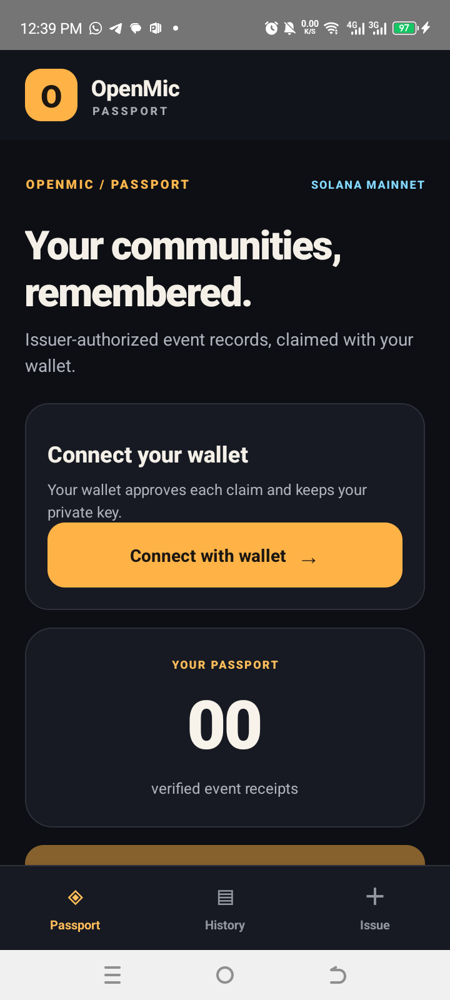
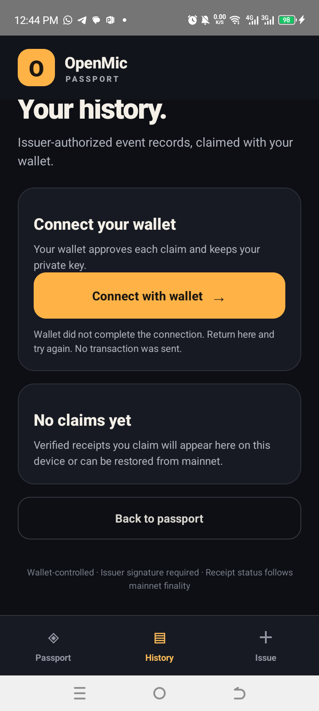
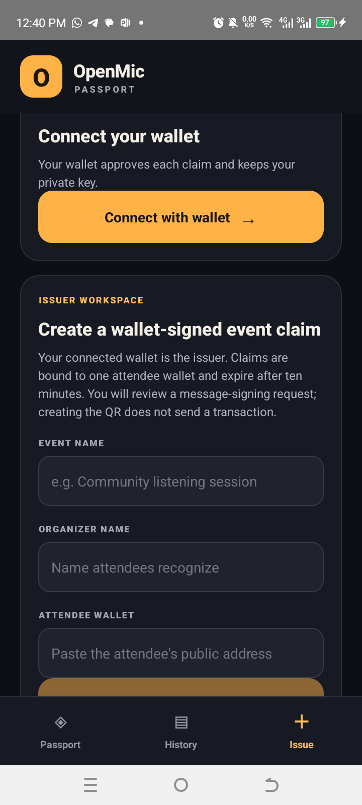

# OpenMic Passport — CLOCK IN

An Android-native React Native app for issuer-signed event claims. Organizers can sign a short-lived, recipient-bound QR with their connected Solana wallet. Attendees scan it, inspect the event and issuer key, choose whether to trust that key on this device, then review a Memo transaction before approving it in their wallet. The app records the transaction as pending and checks mainnet finality and receipt contents before showing it as verified.

This build is an implementation in progress. CLOCK IN has not supplied an OpenMic issuer key or signed attendee claim. For an event that adopts OpenMic, the organizer uses their own connected wallet as the issuer and signs a separate claim for each attendee; the attendee checks that public wallet address through a trusted separate channel. A self-issued sample claim is not proof of CLOCK IN sponsorship or attendance. A Jupiter message-signing request was approved on the previous build, but OpenMic rejected its response format. No claim QR has been issued and no receipt transaction has been submitted. The current 1.1.1 release uses the locally generated OpenMic release signing key. Keep its keystore and `android/keystore.properties` backed up securely and out of source control. See [issuer and event setup](ClockInSpike/docs/issuer-and-event-setup.md) for the full flow.

## Android UI and flow

The app renders native Android views in React Native with a persistent bottom navigation bar for Passport, History, and Issue. It is not a web page wrapped in a WebView. QR scanning uses Google Play services Code Scanner through a small native Android bridge.

Screenshots captured from the installed TECNO KL5 build:

| Passport | History | Issue |
|---|---|---|
|  |  |  |

1. Connect a Solana wallet using Mobile Wallet Adapter.
2. Organizer: enter event name, organizer name, and attendee wallet address; approve the issuer message signature in the wallet; share the displayed QR.
3. Attendee: scan the QR, review the recipient-bound claim and full issuer key, independently verify the key, and explicitly trust it on this device.
4. Review and approve the Memo transaction in the wallet. The transaction carries the signed claim and costs a network fee; it transfers no SOL.
5. The app stores a pending receipt and checks the finalized mainnet transaction, signer, memo, and event fields before marking it verified. History can reconcile pending receipts after restart.

Issuer trust and history are stored locally. Trusting a key only proves the user made that local choice; it does not establish the organizer's real-world identity. This memo-based design does not enforce global uniqueness or prevent a copied valid QR from being submitted elsewhere, and it does not prove physical presence. No attendee personal data should be included in a claim.

Current factual resume status: [docs/resume-status-2026-10-06.md](docs/resume-status-2026-10-06.md). It supersedes older status notes in the handoff and feasibility log.

## Verification status — 2026-10-06

- TypeScript `tsc --noEmit`: passed.
- Jest: passed, 3 suites / 11 tests. These cover deterministic claim validation, memo reconstruction, and basic app rendering; they do not cover live wallet/RPC integration.
- Android `assembleRelease`: passed. Current release APK: `ClockInSpike/android/app/build/outputs/apk/release/app-release.apk`, SHA-256 `4B683B90C68EFD492BD564B6B7B0EA23490D755220D3A39F7A387FAC48AE4170`.
- Latest APK reinstalled and launched on the TECNO KL5 / Android 14. Passport, History, and Issue screens rendered on-device with a native bottom bar. This is React Native native UI, not a WebView.
- Jupiter account authorization and Mainnet context were confirmed on version 1.1.0. Version 1.1.1 was installed over it; the updated app currently requests reconnection, so fresh MWA authorization on 1.1.1 remains to be repeated. The signature-format fix, organizer QR, attendee scan, and mainnet receipt are not yet end-to-end verified.
- TypeScript currently passes. Jest passes 3 suites / 11 tests; these are deterministic validation and rendering tests, not end-to-end wallet or mainnet tests.
- The app's scanner, issuer message signing, QR review, pending receipt, and independent finalized-transaction verifier exist in source, but a real issuer-to-receipt run has not been completed. No claim QR has been issued and no mainnet transaction has been submitted.
- Dependency audit previously reported 50 vulnerabilities. No security review or distribution-signing verification has been completed.

## Build

Use Node/npm, JDK 17, and Android SDK; actual local paths vary.

```powershell
cd ClockInSpike
npm ci
$env:JAVA_HOME = 'C:\path\to\jdk-17'
$env:ANDROID_HOME = 'C:\path\to\Android\Sdk'
$env:ANDROID_SDK_ROOT = $env:ANDROID_HOME
cd android
.\gradlew.bat assembleRelease
```

See [`docs/feasibility-spike.md`](docs/feasibility-spike.md) for device/build history and [`ClockInSpike/docs/claim-protocol.md`](ClockInSpike/docs/claim-protocol.md) for the signed QR and memo format. Do not submit an APK or describe the project as end-to-end verified until the current build has completed the physical-device walkthrough and the demo accurately labels any self-issued test claim.

## CLOCK IN submission status

The app is an Android/MWA claim-flow implementation, not yet a complete hackathon submission. The root Pages site is published at `https://demonchant.github.io`; its asset-links file returns HTTP 200 JSON and Google's Digital Asset Links service recognizes the app package and production release certificate. The latest release is version 1.1.1 / versionCode 3, signed with the OpenMic release key whose fingerprint matches the hosted asset-links file. It is installed on the TECNO KL5, displays the OpenMic label and icon, and is locked to portrait. Current APK SHA-256: `4B683B90C68EFD492BD564B6B7B0EA23490D755220D3A39F7A387FAC48AE4170`. Jupiter authorization succeeded on the previous 1.1.0 build. The updated 1.1.1 signature compatibility fix is installed, but message signing, QR scan, and mainnet receipt still need device verification. Real organizer identity, complete device workflow, demo video, pitch deck, eligibility, and portal checks remain open. See the [MWA Android identity-verification specification](https://github.com/solana-mobile/mobile-wallet-adapter/blob/main/spec/spec.md#android).
